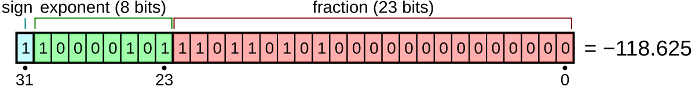

## algorithm

| date   | problem                                                                                  |
| ------ | ---------------------------------------------------------------------------------------- |
| 240805 | 프로그래머스 - 내적(Lv1), 최댓값과 최솟값(Lv2)                                           |
| 240806 | 프로그래머스 - 최대공약수와최소공배수(Lv1), 올바른괄호(Lv2), 이진변환반복하기(Lv2)       |
| 240807 | 프로그래머스 - 3진법 뒤집기(Lv1), 예산(Lv1)                                              |
| 240809 | 프로그래머스 - 숫자 문자열과 영단어(Lv1), 점프와 순간이동(Lv2)                           |
| 240815 | 프로그래머스 - [1차] 비밀지도(Lv1)                                                       |
| 240924 | 프로그래머스 - [1차] 캐시(Lv2)                                                           |
| 241005 | 프로그래머스 - [1차] 뉴스 클러스터링(Lv2)                                                |
| 241006 | 프로그래머스 - [3차] n진수 게임(Lv2)                                                     |
| 241007 | 프로그래머스 - k진수에서 소수 개수 구하기(Lv2)                                           |
| 241025 | 백준 - 설탕 배달(2839) #DP                                                               |
| 241026 | 백준 - 1로 만들기(1463), 2×n 타일링(11726) #DP                                           |
| 241027 | 백준 - DFS와 BFS(1260), 단지번호붙이기(2667) #DFS,BFS                                    |
| 241028 | 백준 - 수 찾기(1920), 숫자 카드 2(10816), 나무 자르기(2805), 랜선 자르기(1654) #이분탐색 |
| 241029 | 백준 - 공유기 설치(2110), 회의실 배정(1931) #Greedy                                      |
| 241030 | 백준 - 연산자 끼워넣기(14888\*) #DP                                                      |
| 241031 | 백준 - 괄호의 값(2504) #스택                                                             |
| 241101 | 백준 - 빗물(14719) #시뮬레이션                                                           |
| 241104 | 백준 - 가르침(1062\*) #완전탐색                                                          |
| 241106 | 백준 - 미로 탐색(2178\*) #BFS                                                            |
| 241107 | 백준 - 특정 거리의 도시 찾기(18352) #BFS                                                 |
| 241108 | 백준 - 유기농 배추(1012) #BFS                                                            |
| 241111 | 백준 - 트리의 부모 찾기(11725) #BFS                                                      |
| 241112 | 백준 - 숨바꼭질(1697) #BFS                                                               |
| 241113 | 백준 - 연결 요소의 개수(11724) #DFS #그래프                                              |
| 241115 | 백준 - 스타트와 링크(14889) #DFS, 정수 삼각형(1932) #DP                                  |
| 241116 | 백준 - 용액(2467\*) #이분탐색, 가장 긴 증가하는 부분 수열(11053\*) #DP                   |
| 241118 | 백준 - 토마토(7576) #BFS                                                                 |
| 241118 | 백준 - 평범한 배낭(12865\*) #DP                                                          |

---

### 💡 Idea

#### 🟡 교집합 & 합집합 개수 구하기

> 결국 개수만 필요한 경우, 각 요소에 대해 개수를 파악해서 min, max로 개수 파악 가능

```js
const set = new Set([...arr1, ...arr2]);

let union = 0;
let intersection = 0;

set.forEach((item) => {
  const has1 = arr1.filter((x) => x === item).length;
  const has2 = arr2.filter((x) => x === item).length;

  union += Math.max(has1, has2);
  intersection += Math.min(has1, has2);
});
```

#### 🟡 n진수 변환

**10진수 -> N진수**

```js
//10진수 -> 2진수
number.toString(2);
//10진수 -> 3진수
number.toString(3);
//10진수 -> N진수
number.toString(N);
```

**N진수 -> 10진수**

```js
//2진수 -> 10진수
parseInt(string, 2);
//3진수 -> 10진수
parseInt(string, 3);
//N진수 -> 10진수
parseInt(string, N);
```

**N진수 -> N진수**

```js
//3진수 -> 2진수
parseInt("21121", 3).toString(2);
```

#### 🟡 소수 판별하기 / 개수 세기

(1) 소수 판별하기

> N - 1 또는, N / 2 까지 계산하면 시간 복잡도가 너무 크기 때문에,
> N의 제곱근까지만 검사.
> 결국 약수는 짝을 지어 존재하기 때문에 N의 제곱근까지만 검사를 해도 된다.

```js
function isPrimeNumber(num) {
  if (num <= 1) return false;

  let res = true;

  for (let i = 2; i <= Math.sqrt(num); i++) {
    if (num % i === 0) {
      res = false;
      break;
    }
  }

  return res;
}
```

(2) 소수 개수 세기

> 에라토스테네스의 체 이용하기.(배열) <br/>
> 마찬가지로 N의 제곱근까지만 시행하면 됨. (e.g. 11^2 > 120 이므로 11보다 작은 수의 배수들만 지워도 충분하다.)

```js
function isPrime(num) {
  // 배열 길이: num + 1 (index 0이 존재하므로)
  let arr = Array(num + 1).fill(true);

  arr[0] = false;
  arr[1] = false;

  for (let i = 2; i <= Math.sqtr(num); i++) {
    if (arr[i]) {
      // 아직 지워지지 않은 수
      // i의 배수들 지우기
      for (let j = i * i; j <= num; j += i) {
        // 반복을 i * i 부터 시작하는 이유:
        // 2 ~ i-1은 이미 이 방식으로 확인된 수들이기 때문
        // e.g. i = 5) 5*2, 5*3, 5*4 는 이미 2,3,4턴에 지워짐.
        arr[j] = false;
      }
    }
  }

  return arr.filter((el) => el).length;
}
```

#### 🟡 2×n 타일

점화식 : `f(N) = f(N-1) + f(N-2)` (피보나치 수열)

> f(N-1) 에 2x1 타일을 하나 더 더하는 경우
> f(N-2) 에 1x2 타일을 두개 더 더하는 경우

#### 🟡 dx,dy 테크닉

```js
// 상하좌우
const dx = [0, 0, 1, -1];
const dy = [1, -1, 0, 0];

function isVariableArea(x, y) {
  if (x < 0 || x >= N || y < 0 || y >= N) return false;
  if (visited[x][y] || graph[x][y] === 0) return false;
  return true;
}

// 상하좌우 탐색
for (let i = 0; i < 4; i++) {
  const nextX = x + dx[i];
  const nextY = y + dy[i];

  // 가능한 곳이라면 (존재하고, 방문하지 않은)
  if (isVariableArea(nextX, nextY)) {
    DFS(nextX, nextY); // 그 곳에서 또 탐색
  }
}
```

#### 🟡 `arr.sort` 메소드

`arr.sort([compareFunction])`

> `compareFunction`생략하면 배열은 각 요소의 문자열 변환에 따라 각 문자의 **유니 코드 코드 포인트 값**에 따라 정렬된다.
> 숫자 정렬에서는 9가 80보다 앞에 오지만 숫자는 문자열로 변환되기 때문에 "80"은 유니 코드 순서에서 "9"앞에 온다.

```js
const array1 = [1, 30, 4, 21, 100000];
array1.sort();
console.log(array1);
// Expected output: Array [1, 100000, 21, 30, 4]
```

👉 숫자를 정렬할 땐 반드시 정렬 함수 써줄것

#### 🟡 -0

> [ 부동소수점 표기 ]<br/>
> 최상위 비트(부호 표기), 지수 부분, 가수 부분이 있음.<br/> `(가수)*2^(지수)`<br/><br/> <br/><br/>
> e.g. <br/>0.1을 입력하면 -> 64비트 IEEE 754 형식에 따라 2진법 변환 -> 다시 10진법 변환하여 표시

- js에서 0과 -0은 다르다. (부동소수점 - 부호 표기)
- 근데 연산자를 사용한 비교연산은 true임.

```js
0 === -0; // true
1 + -0; // 1
```

- `Object.is`는 false
- 곱셈/나눗셈에서도 다름

```js
1 * -0; // -0
1 / 0; // Infinity
1 / -0; // -Infinity
```

#### 🟡 ~, ~~ 연산자

- `~a`: NOT 연산자.
  각 자리의 비트를 뒤집는다.<br/>
  => a 를 32비트 정수로 변환하는 과정에서 소수 부분이 버려진다.<br/>
  => `~~a`: 소수 부분이 버려지고, 다시 부호를 되돌린다.

---

### 🚨 Trouble shooting

#### 🟡 조건을 상세하고 까다롭게 작성하기

BFS에서 `if (distance[destV]) return;` 라는 조건을 썼는데, distance 중 0의 값도 있었던 것.

#### 🟡 답에서 필요한 것 기준으로 생각하기

트리에서 모든 노드의 부모 노드를 구하는 문제 => 각 노드의 부모만 저장하면 된다
즉, 전체 트리 구조를 만들 필요도 없음

#### 🟡 메소드의 시간복잡도도 생각하자

- `Array.includes()` 시간복잡도 O(n)<br/>
- `Set.has()` 시간복잡도 O(1)

#### 🟡 배낭 문제 (#DP)

> [ 점화식 ]<br/> > `P[i][j]` : `1~i번째 물건`을 사용하여 `최대 j 무게` 안에서 => 만들 수 있는 **최대 가치 값**
>
> ```js
> P[i][j]
> = P[i-1][j] (i.weight > j)
> = Math.max(P[i-1][j], P[i-1][j-i.weight] + i.value) (i.weight <= j)
> ```

🔽 풀이 설명<br/>
1~i번쨰 물건을 사용하여 최대 j 무게 안에서 만들 수 있는 최대 가치 값은

- i 번째 물건 무게가 j 보다 크면)<br/> 아예 넣을 수 없으므로 1~i-1번째 물건으로 구한 최대값
- i 번째 물건 무게가 j 보다 작거나 같으면)<br/>
  Max(<br/>
  `i번째거 안들어가는 경우` 1~i-1번째 물건으로 구한 최대값,<br/>
  `i번째거 들어가는 경우` 1~i-1번째 물건을 사용해 **i번째 무게를 뺀** 만큼 만들어진 최대값 + i번째 물건 가치값<br/>)

---

### 🔑 Algorithm

#### 🔵 DP

1. 점화식 생각하기

- 최소 N값 (N = 1,2,3..) return값 정의하기
- memoization 이용하기 (`const memo = new Array(N)`)

2. 점화식이 아닐수도 있음

- 이전 값들을 저장해두고 그 값들을 이용해서 +1 한다던지 이런 방식도 생각해보기

#### 🔵 DFS/BFS

DFS로 정답은 나오지만, 시간 초과가 난다? 👉 BFS 생각하기

- DFS: 깊이 우선 탐색
  - **재귀함수** 이용하기
  - 인접 행렬
    ```js
    function dfs(vertex) {
    	for (let currV = 1; currV <= VERTICES_NUM; currV++) {
    		if(graph[vertex][currv] === 1 && !visited[currV] {
    			console.log(currV);
    			visited[currV] = true;
    			dfs(currV);
    		}
    	}
    }
    ```
  - 인접 리스트
    ```js
    function dfs(vertex) {
      for (let i = 0; i < graph[vertex].length; i++) {
        let currV = graph[vertex][i];
        if (!visited[currV]) {
          console.log(currV);
          visited[currV] = true;
          dfs(currV);
        }
      }
    }
    ```
- BFS: 너비 우선 탐색

  - **queue** 이용하기
  - 인접 행렬

    ```js
    function BFS() {
      while (!q.empty()) {
        let currV = q.pop();

        for (let nextV = 1; nextV <= VERTICES_NUM; nextV++) {
          if (graph[currV][nextV] === 1 && !visited[nextV]) {
            console.log(nextV);
            visited[nextV] = true;
            q.push(nextV);
          }
        }
      }
    }
    ```

  - 인접 리스트

    ```js
    function BFS() {
    	while(!q.empty()) {
    		int currV = q.pop();

    		for(int i=0; i < graph[currV].size(); i++) {
    			int nextV = graph[currV][i];
    			if(!visited[nextV]) {
    				console.log(nextV);
    				visited[nextV] = true;
    				q.push(nextV);
    			}
    		}
    	}
    }
    ```

#### 🔵 이분탐색

주어진 배열이 이분탐색의 범위가 되는 경우 말고도,
주어진 조건을 해결하기 위해 그냥 숫자가 이분탐색의 범위가 될 수 있다.

#### 🔵 백트래킹

백트래킹(되추적): 모든 경우의 수를 조사하지만, 유망한 경우만 검사.

- dfs로 내려가다가, 해당 노드가 조건에 맞지 않는다고 생각되면 그 경우를 잘라내고 다시 상위 노드로 돌아가 다른 하위 노드로 내려가는 과정을 반복

#### 🔵 완전탐색/브루트포스 알고리즘

- 완전 탐색: 모든 경우의 수를 전부 탐색
  **탐색 과정**에 중점을 둔다.

  - 💡 DFS로도 완전탐색을 할 수 있다! (#1062)

- 브루트포스: 모든 경우의 수를 전부 탐색
  **결과를 찾는 것**에 중점을 둔다.

#### 🔵 그래프

- 인접 행렬 (`graph[u][v]`) 또는 인접 리스트(`graph[u].push(v)`)로 나타내기

#### 🔵 이분탐색

`while(left < right)` 동안 정렬된 배열에 대해 mid > answer 이면 right = mid - 1, mid < answer 이면 left = mid + 1

#### 🔵 투포인터

left,right 둘 다 start에서 시작해서 left,right를 조건에 따라 늘려나감

- 특정한 값을 가지는 연속 수열

#### 🔵 다익스트라/벨만-포트

> 최단 경로 탐색 알고리즘

- ## 다익스트라
